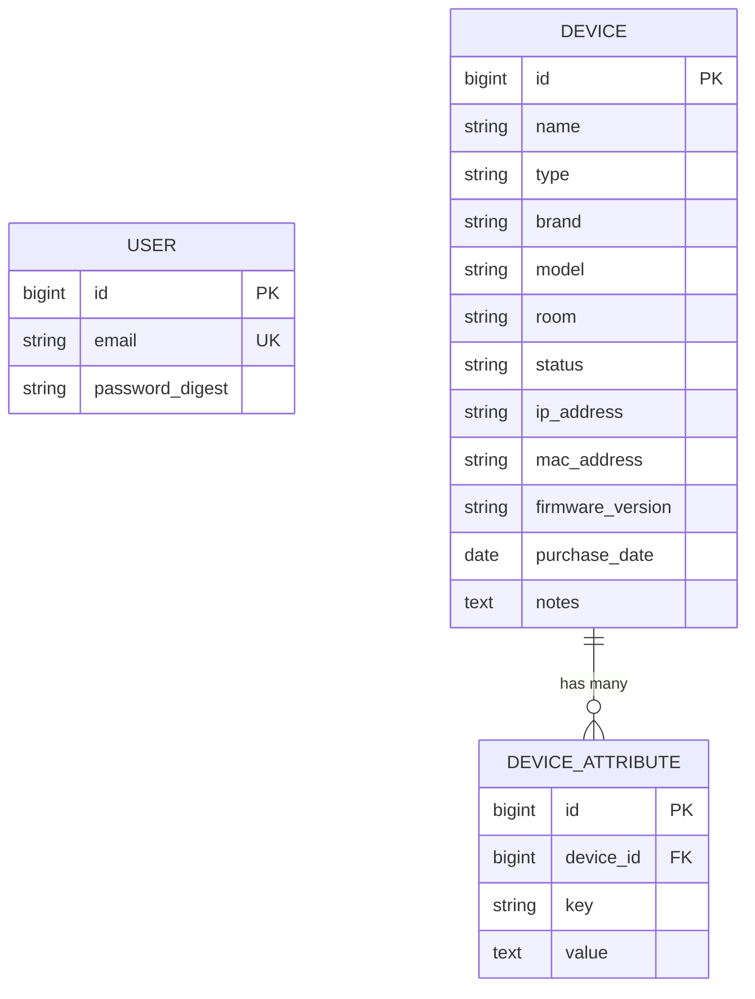
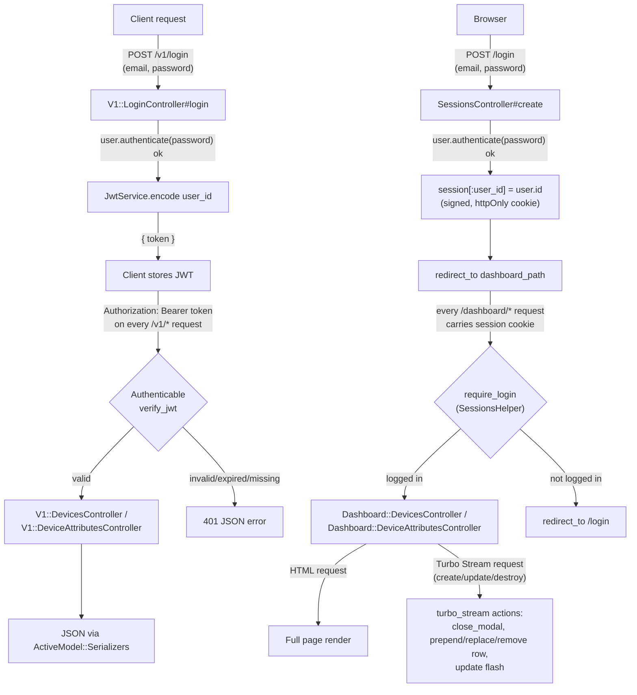

# Habitat

Habitat is a smart-home device management API and dashboard, built as a
personal learning project for Ruby on Rails and Spec-Driven Development
(SDD). It models a Home Assistant Green style setup: a hub device, a Zigbee
dongle, and a set of Zigbee end devices (smart plugs, LED controllers, binary
sensors, relays, power strips), each with an arbitrary set of key/value
attributes (state, battery level, RSSI, etc.).

The project exists to practice building a real Rails app end to end: a JSON
API with token auth, a server-rendered HTML dashboard on the *same*
API-only codebase, Hotwire (Turbo + Stimulus) for a modal-driven UI without
a JS framework, RSpec at every layer (models, requests, controllers, system
specs with a real headless browser), and a written SDD workflow
(explore → propose → spec → design → tasks → apply → verify → archive) for
every change.

## Tech stack

- **Ruby 3.3.12 / Rails 7.1.6**, configured with `config.api_only = true`
- **PostgreSQL 16** (via Docker Compose for local dev)
- **JWT** (`jwt` gem) for the JSON API's bearer-token auth
- **bcrypt** (`has_secure_password`) for user password hashing
- **ActiveModel::Serializers** for JSON API responses
- **Hotwire**: `turbo-rails` + `stimulus-rails` + `importmap-rails` for the
  dashboard (no Node/webpack build step — JS ships as ES modules via
  `importmap`, assets served by `propshaft`)
- **RSpec** + **FactoryBot** for models/requests/controllers;
  **Capybara** + **Cuprite** (headless Chrome over CDP) + **DatabaseCleaner**
  for browser-driven system specs
- **Docker Compose** (`app` + `db`) for local development on Windows

## Architecture overview

Habitat is a single Rails app serving two very different clients from one
codebase:

- **`/v1/*` — JSON API**, authenticated with a JWT bearer token. Meant for
  external clients (e.g. Home Assistant automations, scripts, a future
  mobile app). Controllers live under `app/controllers/v1/`, all inherit
  from `V1::BaseController`, which mixes in the `Authenticable` concern
  (`app/concerns/authenticable.rb`). That concern runs a `before_action`
  that extracts `Authorization: Bearer <token>`, decodes it with
  `JwtService` (`lib/jwt_service.rb`, HS256, 1-day expiry by default), loads
  the `User`, and renders `401` on any failure (missing header, expired
  token, unknown user).
- **`/dashboard/*` — server-rendered HTML**, authenticated with a signed,
  httpOnly session cookie (`SessionsController`, `SessionsHelper#require_login`).
  This is a completely separate auth system from the JWT API — logging into
  the dashboard does not issue a JWT, and a JWT does not grant dashboard
  access.

The app started life as `config.api_only = true` (see
`config/application.rb`), which strips Rails down to the middleware an API
needs and skips generating views/helpers/assets by default. Once the
dashboard was added, three pieces of "browser app" middleware had to be
added back **manually**, each with a comment at the call site explaining
why:

1. `ActionDispatch::Cookies` + the session store — the dashboard needs
   cookie-based sessions; API-only mode has neither.
2. `ActionDispatch::Flash` — API-only mode skips *requiring the file at
   all*, so without this line `flash` isn't just empty, it's a
   `NoMethodError` on `ActionDispatch::Request`.
3. `Rack::MethodOverride` — the dashboard's edit/update/destroy forms are
   real HTML `<form>` elements using Rails' `_method` hidden-field trick to
   fake PATCH/PUT/DELETE. Without this middleware every edit/delete form
   silently POSTed to a PATCH/DELETE-only route and 404'd — a bug that only
   a real browser or a Capybara system spec would ever catch, since request
   specs call `patch`/`delete` directly and never exercise the
   method-override path.

On top of the dual auth split, the dashboard's device and device-attribute
CRUD (`Dashboard::DevicesController`, `Dashboard::DeviceAttributesController`)
uses Turbo Streams instead of full page reloads: `create`/`update`/`destroy`
render a list of `turbo_stream` actions that patch the DOM directly (close
the modal, prepend/replace/remove a row, update the flash region). Modals
are driven by three small Stimulus controllers
(`app/javascript/controllers/`): `modal_controller.js` (open/close, focus
trap, Escape-to-close, return focus to the trigger), `modal_trigger_controller.js`
(opens a modal that lives elsewhere in the DOM via a Stimulus *outlet*, since
plain `data-action` only bubbles up through ancestors), and
`confirm_delete_controller.js` (wires a delete-confirmation modal instead of
a browser `confirm()` dialog, so it's accessible and stylable). A custom
Turbo Stream action, `close_modal` (`turbo_stream_actions.js`), lets the
*server* tell a specific modal to close as part of a stream response.

### Data model

`Device` has a `type` column driven by a closed Rails `enum`
(`smart_plug`, `led_controller`, `binary_sensor`, `relay`, `power_strip`,
`hub`, `zigbee_dongle`). Since `type` is used as plain enum data rather than
for Single Table Inheritance, `Device` explicitly overrides
`self.inheritance_column = :_type_id` to stop Rails from treating the column
as an STI discriminator. Each `Device` `has_many :device_attributes`
(EAV-style key/value pairs — `key`/`value` strings, unique per device),
letting devices carry arbitrary state (`power_state`, `battery_level`,
`rssi`, ...) without a rigid schema. `User` is a simple `has_secure_password`
model used by both auth systems (its `id` ends up either in a JWT payload or
in the session, depending on which system authenticated it).



`USER` has no direct foreign-key relationship to `DEVICE` in the schema —
it authenticates *access* to devices (via JWT for the API, via session for
the dashboard) rather than owning them.

### Dual-auth request flow



## Running locally (Docker Compose)

```bash
docker compose up --build
```

This starts two services (`docker-compose.yml`):

- `db` — Postgres 16, with a named volume for persistence and a healthcheck
  that gates the app container's startup
- `app` — the Rails server (`rails server -b 0.0.0.0`) on `localhost:3000`,
  with the project directory bind-mounted for live code reload (Windows
  host, so Docker is used instead of a native Ruby install)

First-time setup (once the containers are up):

```bash
docker compose exec app bin/rails db:create db:migrate
```

Then visit `http://localhost:3000/dashboard` (session login) or hit
`http://localhost:3000/v1/login` (JWT) for the API.

## Running tests

The full suite runs inside the `app` container against the same Postgres
instance (RSpec creates/uses `habitat_test`):

```bash
docker compose exec app bundle exec rspec
```

Run a single file or line:

```bash
docker compose exec app bundle exec rspec spec/models/device_spec.rb
docker compose exec app bundle exec rspec spec/system/dashboard/devices/create_spec.rb:12
```

Spec layout:

- `spec/models/` — `Device`, `DeviceAttribute`, `User` validations/associations
- `spec/lib/jwt_service_spec.rb`, `spec/concerns/authenticable_spec.rb` — JWT encode/decode and the auth `before_action`
- `spec/controllers/v1/*` — JSON API request-style controller specs
- `spec/requests/` — `sessions_spec.rb`, `dashboard_spec.rb`, `dashboard/devices_spec.rb`, `dashboard/device_attributes_spec.rb`
- `spec/system/dashboard/` — real headless-Chrome (Cuprite) specs driving login, device CRUD, device-attribute CRUD, and accessibility (focus trap, keyboard nav)

System specs use `DatabaseCleaner` with **truncation** instead of the usual
transactional rollback, because Puma runs the app under system specs on its
own thread with its own DB connection, invisible to the test thread's open
transaction (see the comment block in `spec/rails_helper.rb`).

**Known issue**: `spec/requests/dashboard_spec.rb` and
`spec/requests/dashboard/*_spec.rb` currently fail with
`403 Blocked hosts: www.example.com` — an `ActionDispatch::HostAuthorization`
/ test-host-config issue, not an app bug. See `CLAUDE.md` for details before
assuming a change broke these.

## Directory structure

```
app/
  concerns/authenticable.rb        # JWT before_action, shared by all V1 controllers
  controllers/
    v1/                            # JSON API: login, devices, device_attributes
    dashboard/                     # HTML dashboard: devices, device_attributes
    sessions_controller.rb         # Dashboard login/logout (session-based)
    dashboard_controller.rb        # Dashboard home -> redirects to devices list
  helpers/sessions_helper.rb       # current_user / logged_in? / require_login
  javascript/controllers/          # Stimulus: modal, modal_trigger, confirm_delete, flash, turbo_stream_actions
  models/                          # Device (enum type), DeviceAttribute (EAV), User
  serializers/                     # ActiveModel::Serializers for the JSON API
  views/
    dashboard/                     # devices/, device_attributes/ partials + full views
    shared/_modal.html.erb         # reusable modal shell used by every dashboard modal
    shared/_flash.html.erb         # flash partial, re-rendered via Turbo Stream too
lib/jwt_service.rb                 # HS256 encode/decode, 1-day default expiry
config/
  routes.rb                        # /v1/* (JWT API) vs /dashboard/* (session HTML)
  application.rb                   # config.api_only = true + manually restored middleware
spec/                              # models, lib, concerns, controllers, requests, system
```

## SDD workflow

This project was built change-by-change using a written Spec-Driven
Development process: explore -> propose -> spec -> design -> tasks -> apply
-> verify -> archive. Evidence of this lives at the repo root as
per-change markdown artifacts, e.g. `design.md`, `design-api-auth.md`,
`design-dashboard.md`, `tasks-api-auth.md`, `ARCHIVE-api-foundation-with-auth.md`,
and `ARCHIVE-device-dashboard.md` — each archive doc records the executive
summary, key decisions, and file-by-file implementation summary for that
change once it shipped.
